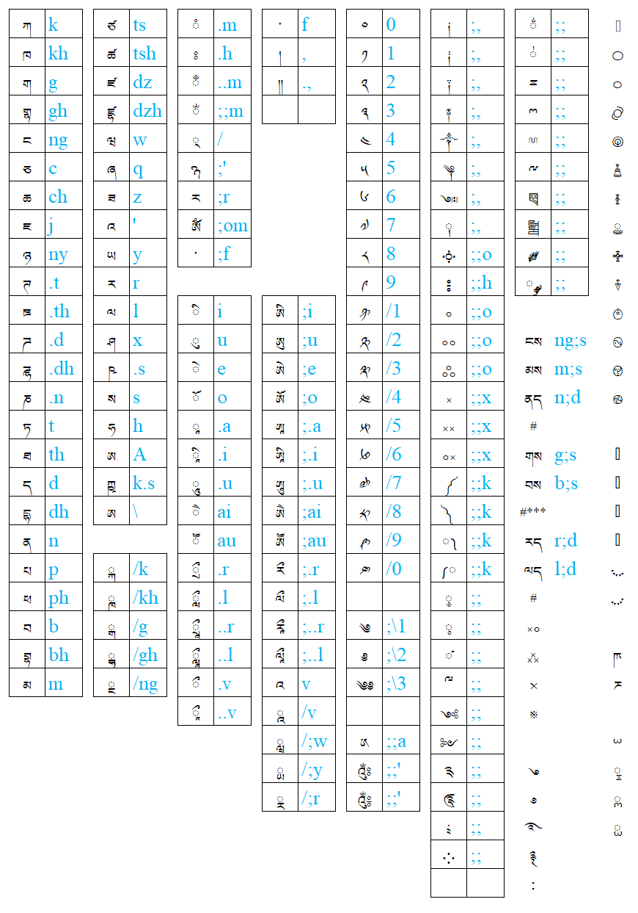

# **Rime小狼毫輸入法安裝與使用**

https://docs.qq.com/doc/DQW1nbmZZTEFNQVNx

# **rime梵藏輸入方案**

- **天城體** devanagari

https://github.com/arpcn/rime-devanagari/

- **IAST**

https://github.com/arpcn/rime-iast

- **悉曇體**及**婆羅米** Siddham & Brahmi

https://github.com/arpcn/rime-siddham

- **藏文**

https://github.com/arpcn/rime-tibetan

# **鍵盤分布**

這一套輸入方案中，IAST、天城、悉曇、婆羅米、藏文，都是[**一樣的編碼方式**](#)。

查看 ☞ <b><i>表格文本</i></b> ☜ 點擊 ◂ 

|ཀ|k||ཙ|ts||ཾ|.m||་|f||༠|0||༏|;,||྆|;;||཈|
|-|-|-|-|-|-|-|-|-|-|-|-|-|-|-|-|-|-|-|-|-|-|
|ཁ|kh||ཚ|tsh||ཿ|.h||།|,||༡|1||༐|;,||྇|;;||࿀|
|ག|g||ཛ|dz||ྃ|..m||༎|.,||༢|2||༑|;,||ྈ|;;||࿁|
|གྷ|gh||ཛྷ|dzh||ྂ|;;m|||||༣|3||༈|;,||ྉ|;;||࿂|
|ང|ng||ཝ|w||྄|/|||||༤|4||༒|;,||ྊ|;;||࿃|
|ཅ|c||ཞ|q||྅|;'|||||༥|5||༆|;,||ྋ|;;||࿄|
|ཆ|ch||ཟ|z||ཪ|;r|||||༦|6||༇|;,||༕|;;||࿅|
|ཇ|j||འ|'||ༀ|;om|||||༧|7||༙|;,||༖|;;||࿆|
|ཉ|ny||ཡ|y||༌|;f|||||༨|8||༓|;;o||༗|;;||࿇|
|ཊ|.t||ར|r||||||||༩|9||༔|;;h||༘|;;||࿈|
|ཋ|.th||ལ|l||ི|i||ཨི|;i||༪|/1||༚|;;o|||||࿉|
|ཌ|.d||ཤ|x||ུ|u||ཨུ|;u||༫|/2||༛|;;o||ངས|ng;s||࿊|
|ཌྷ|.dh||ཥ|.s||ེ|e||ཨེ|;e||༬|/3||༜|;;o||མས|m;s||࿋|
|ཎ|.n||ས|s||ོ|o||ཨོ|;o||༭|/4||༝|;;x||ནད|n;d||࿌|
|ཏ|t||ཧ|h||ཱ|.a||ཨཱ|;.a||༮|/5||༞|;;x||#||||
|ཐ|th||ཨ|A||ཱི|.i||ཨཱི|;.i||༯|/6||༟|;;x||གས|g;s||࿕|
|ད|d||ཀྵ|k.s||ཱུ|.u||ཨཱུ|;.u||༰|/7||༼|;;k||བས|b;s||࿖|
|དྷ|dh||ཨ|\ ||ཻ|ai||ཨཻ|;ai||༱|/8||༽|;;k||#***|||࿗|
|ན|n|||||ཽ|au||ཨཽ|;au||༲|/9||༾|;;k||རད|r;d||࿘|
|པ|p||ྐ|/k||ྲྀ|.r||རྀ|;.r||༳|/0||༿|;;k||ལད|l;d||࿙|
|ཕ|ph||ྑ|/kh||ླྀ|.l||ལྀ|;.l|||||༵|;;||#|||࿚|
|བ|b||ྒ|/g||ཷ|..r||རཱྀ|;..r||༄|;\\1||༷|;;||࿎||||
|བྷ|bh||ྒྷ|/gh||ཹ|..l||ལཱྀ|;..l||༅|;\\2||༹|;;||࿏|||ཫ|
|མ|m||ྔ|/ng||ྀ|.v||འ|v||༄༅|;\\3||༸|;;||྾|||ཬ|
|||||||ཱྀ|..v||ྰ|/v|||||༺|;;||྿||||
||||||||||ྺ|/;w||༁|;;a||༻|;;|||||ྌ|
||||||||||ྻ|/;y||༂|;;'||༉|;;||࿓|||ྍ|
||||||||||ྼ|/;r||༃|;;'||༊|;;||࿔|||ྎ|
||||||||||||||||༴|;;||࿐|||ྏ|
||||||||||||||||༶|;;||࿑||||
|||||||||||||||||||࿒||||

**少數藏文特殊符號**可以在`tibetan.dict.yaml`中自定義。

